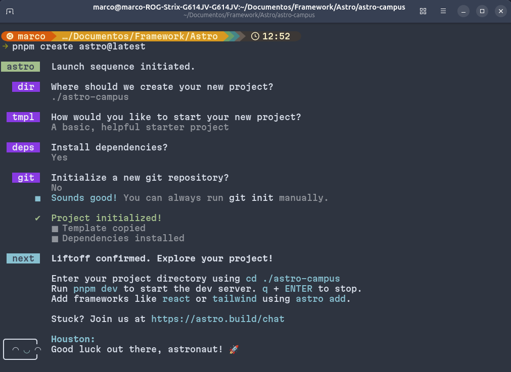
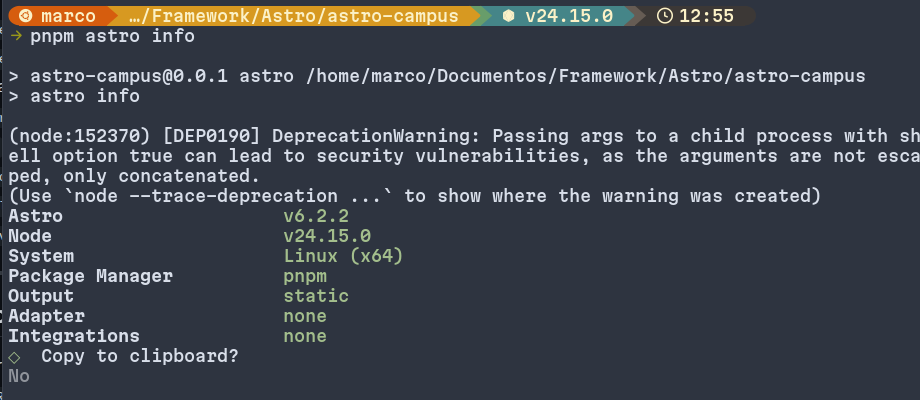
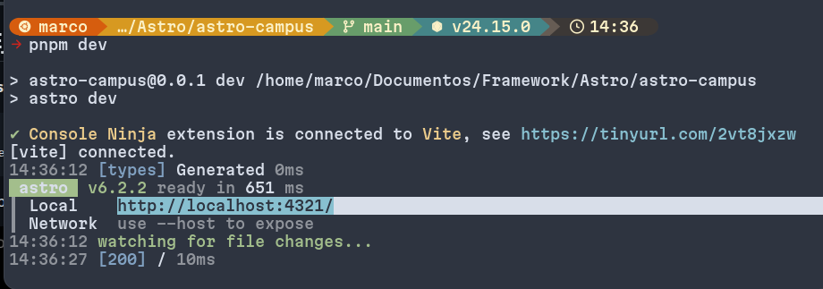
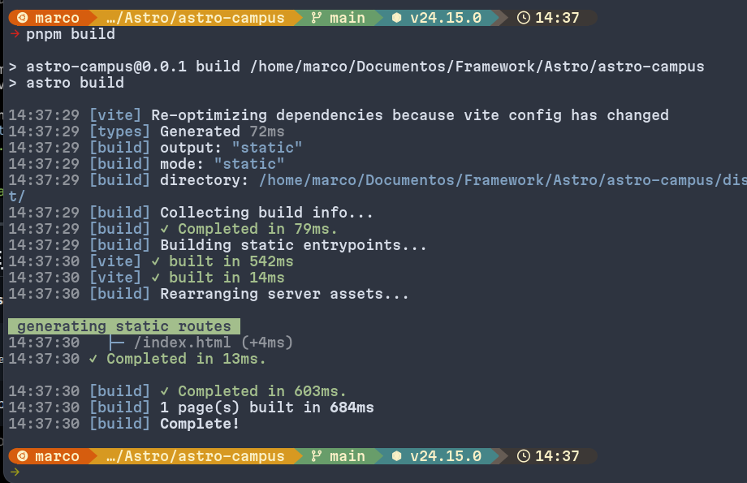
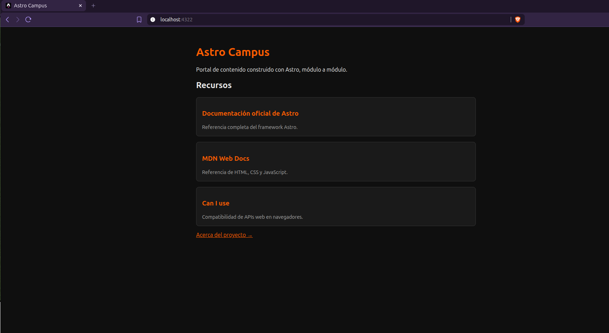
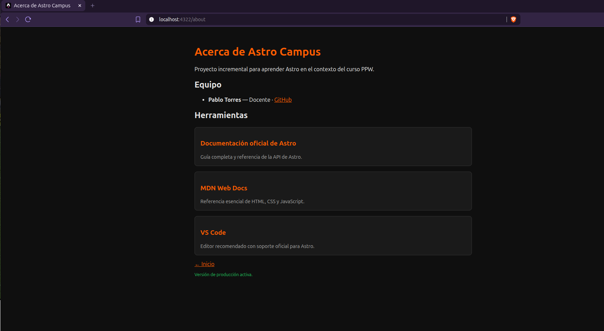

# Astro Starter Kit: Basics

```sh
pnpm create astro@latest -- --template basics
```

## 🚀 Proyecto: Instalación y Configuración de Astro
### 📖 Descripción

En este proyecto documenté el proceso de instalación, configuración y ejecución de Astro, un framework moderno para el desarrollo de sitios web rápidos y optimizados.

A lo largo de esta práctica, trabajé con herramientas actuales del ecosistema frontend para crear un proyecto desde cero y comprender cómo funciona Astro en un entorno real de desarrollo.

## 🎯 Objetivo

Mi objetivo con este proyecto fue:

- Aprender a configurar correctamente un entorno de desarrollo con Astro.
- Crear un proyecto desde cero utilizando su CLI.
- Comprender la estructura básica del framework.
- Ejecutar y visualizar una aplicación en un servidor local.
- Familiarizarme con los comandos principales para el desarrollo.

## ⚙️ Requisitos Previos

Antes de comenzar, me aseguré de tener instalado:

- Node.js (versión 18.17.1 o superior)
- Un editor de código (Visual Studio Code recomendado)
- Terminal o línea de comandos

Astro requiere Node.js actualizado y se maneja principalmente mediante comandos CLI.

## 📦 Instalación
1. Crear el proyecto con Astro CLI

Ejecutar el siguiente comando:

```bash 
pnpm create astro@latest
```
2. Acceder al proyecto

```bash
cd nombre-del-proyecto
```

3. Ejecutar el servidor de desarrollo

```bash
pnpm run dev
```

Luego abrí el navegador en:

http://localhost:4321

Astro inicia un servidor local que permite visualizar los cambios en tiempo real mientras desarrollo .

## 🚀 Project Structure

Inside of your Astro project, you'll see the following folders and files:

```text
/
├── public/
│   └── favicon.svg
├── src
│   ├── assets
│   │   └── astro.svg
│   ├── components
│   │   └── Welcome.astro
│   ├── layouts
│   │   └── Layout.astro
│   └── pages
│       └── index.astro
└── package.json
```

To learn more about the folder structure of an Astro project, refer to [our guide on project structure](https://docs.astro.build/en/basics/project-structure/).

## 🧞 Commands

All commands are run from the root of the project, from a terminal:

| Command                   | Action                                           |
| :------------------------ | :----------------------------------------------- |
| `pnpm install`             | Installs dependencies                            |
| `pnpm dev`             | Starts local dev server at `localhost:4321`      |
| `pnpm build`           | Build your production site to `./dist/`          |
| `pnpm preview`         | Preview your build locally, before deploying     |
| `pnpm astro ...`       | Run CLI commands like `astro add`, `astro check` |
| `pnpm astro -- --help` | Get help using the Astro CLI                     |

## Evidencias


**Creacion proyecto en Astro**


**Informacion de ASTRO**


**Corriendo en la localhost**


**Salida a Produccion**

## Practica 2


**Salida Localhost**


**Pagina about con los cards renderizados**

## 👀 Want to learn more?

Feel free to check [our documentation](https://docs.astro.build) or jump into our [Discord server](https://astro.build/chat).
